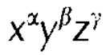
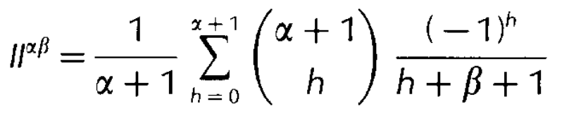
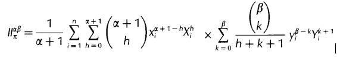

# Lar Integrals

### Introduzione

Questo modulo implementa un metodo di integrazione finita di polinomi del tipo:

Vengono implementate due funzioni *II* e *III* che permettono di fare rispettivamente l'integrale di superficie e di volume di polinomi del tipo specificato.

L'integrale di superficie viene calcolato facendo facendo la somma  degli integrali dei triangoli. I triangoli devono essere ottenuti triangolando opportunamente la superficie.

La funzione *TT* permette di calcolare l'integrale sul singolo triangolo.

L'integrale di volume si ottiene facilmente grazie al Teorema della Divergenza; questo teorema permette di trasformare un integrale di volume in un integrale di superficie.

È importante notare che tutti i domini, sia 2D che 3D, sono definiti in 3 dimensioni.

### Funzioni

La funzione `function M(alpha::Int, beta::Int)::Float64` calcola la seguente formula:

Che con `alpha = 0 e beta = 0` si riduce al calcolo dell'area del triangolo con vertici `w_o = (0, 0), w_a = (1, 0), w_b = (0, 1)`, pari a `1/2`.

La funzione `function II(P::LAR, alpha::Int, beta::Int, gamma::Int, signedInt=false)::Float64` permette di calcolare l'integrale di un triangolo implementando la seguente formula:

Le funzioni:

* `function II(P::LAR, alpha::Int, beta::Int, gamma::Int, signedInt=false)::Float64`
* `function III(P::LAR, alpha::Int, beta::Int, gamma::Int)::Float64`

