# Lar Integrals

## Introduzione

Questo modulo implementa un metodo di integrazione finita di polinomi del tipo: 

$x^{\alpha}y^{\beta}z^{\gamma}$

Vengono implementate due funzioni `II` e `III` che permettono di fare rispettivamente l'integrale di superficie e di volume di polinomi del tipo specificato.

L'integrale di superficie viene calcolato facendo facendo la somma  degli integrali dei triangoli che compongono la superficie, ottenuti tramite triangolazione della superficie stessa.

La funzione `TT` permette di calcolare l'integrale sul singolo triangolo.

L'integrale di volume si ottiene facilmente grazie al Teorema della Divergenza; questo teorema permette di calcolare un integrale di volume da un integrale di superficie.

È importante notare che tutti i domini, sia 2D che 3D, sono definiti in 3 dimensioni.

\newpage

## Grafo delle dipendenze

Di seguito è riportata l'illustrazione del grafo delle dipendenze della base di codice. In particolare, sul questo grafo sono riportati
i nodi che rappresentano le funzioni della base di codice e dove ogni arco orientato rappresenta una chiamata di funzione (v1, v2), dove v1 è la funzione 
chiamante, e v2 è la funzione chiamata. Gli archi hanno un'etichetta numerica consecutiva corrispondente all’ordine
delle chiamate dal nodo loro origine.

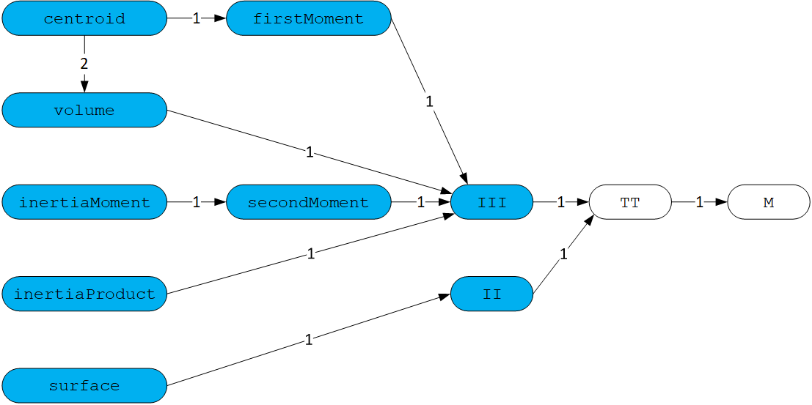

In blu sono rappresentate le interfacce principali del modulo.

## Descrizione funzioni di integrazione

La funzione `function M(alpha::Int, beta::Int)::Float64` calcola la seguente formula:

$II^{\alpha\beta} = \frac{1}{\alpha + 1}\sum_{h=0}^{\alpha + 1}{\binom{\alpha + 1}{h}\frac{(-1)^h}{h+\beta+1}}$

Che con $\alpha=0$ e $\beta=0$ si riduce al calcolo dell'area del triangolo con vertici $w_o = (0, 0)$, $w_a = (1, 0)$ e $w_b = (0, 1)$, pari a $\frac{1}{2}$. Consideriamo la seguente funzione:

    function TT(tau::Array{Float64,2}, 
    	alpha::Int, beta::Int, gamma::Int, signedInt::Bool=false)
	    vo,va,vb = tau[:,1],tau[:,2],tau[:,3]
	    a = va - vo
	    b = vb - vo
	    s1 = 0.0
	    for h=0:alpha
	        for k=0:beta
	            for m=0:gamma
	                s2 = 0.0
	                for i=0:h 
	                    s3 = 0.0
	                    for j=0:k
	                        s4 = 0.0
	                        for l=0:m
	                            s4 += binomial(m,l) * a[3]^(m-l) * b[3]^l * 
	                            	  M(h+k+m-i-j-l, i+j+l)
	                        end
	                        s3 += binomial(k,j) * a[2]^(k-j) * b[2]^j * s4
	                    end
	                    s2 += binomial(h,i) * a[1]^(h-i) * b[1]^i * s3;
	                end
	                s1 += binomial(alpha,h) * binomial(beta,k) * binomial(gamma,m) * 
	                      vo[1]^(alpha-h) * vo[2]^(beta-k) * vo[3]^(gamma-m) * s2
	            end
	        end
	    end
	    c = cross(a,b)
	    if signedInt == true
	        return s1 * norm(c) * sign(c[3])
	    else
	        return s1 * norm(c)
	    end
    end

Permette di calcolare l'integrale di un triangolo implementando la seguente formula:

$II_{\tau}^{\alpha\beta\gamma} = & II^{uv}|a \times b| \cdot \\ & \cdot \sum_{h=0}^{\alpha}\binom{\alpha}{h}x_0^{\alpha-h}\sum_{k=0}^{\beta}\binom{\beta}{k}y_0^{\beta-k}\sum_{m=0}^{\gamma}\binom{\gamma}{m}z_0^{\gamma-m} \cdot \\ & \cdot \sum_{i=0}^{h}\binom{h}{i}a_x^{h-i}b_x^i\sum_{j=0}^{k}\binom{k}{j}a_v^{k-j}b_y^j\sum_{l=0}^{m}\binom{m}{l}a_z^{m-l}b_z^l$

Dato il triangolo $\tau$,  come array di array di vertici di  tre dimensioni 
$v_o = (x_o, y_o, z_o)$, estraiamo i vertici $v_o, v_a, v_b$. 
Estratti i vertici calcoliamo i vettori $a$ e $b$ e l’equazione parametrica 
del piano di inclusione del triangolo vale $p = v_o + u * a + v * b$.  

Possiamo  notare come $s4$ corrisponda all’ultima sommatoria e l’ultimo 
termine della sommatoria corrisponda alla funzione `M` (con  $u = (h+k+m) - (i+j+l)$  e $v=(i+j+l)$), $s3$ alla penultima sommatoria, $s2$ alla terz’ultima sommatoria e $s1$ alle prime tre sommatorie. Alla fine viene eseguito il prodotto vettoriale fra $a$ e $b$.

Le funzioni:

* `function II(P::LAR, alpha::Int, beta::Int, gamma::Int, signedInt=false)::Float64`

* `function III(P::LAR, alpha::Int, beta::Int, gamma::Int)::Float64`

Permettono di calcolare rispettivamente l'integrale doppio e l'integrale triplo di un polinomio che ha come dominio un poligono; l'integrale viene calcolato attraverso la somma delle aree dei triangoli (funzione `TT`) ottenuti dalla suddivisione della sua superficie.

## Esempi e valutazione delle prestazioni nella versione iniziale

L'ogetto considerato come esempio per il calcolo del volume e per valutare le prestazioni del codice
è il modello 3D *Stanford Bunny*;
Il modello *Stanford Bunny* è stato originariamente costruito nel 1994 
da Greg Turk e Marc Levoy utilizzando una tecnica, chiamata scansione della distanza, che hanno sviluppato per creare 
modelli poligonali. 

Il modello Bunny che hanno creato consisteva esattamente in 69.451 triangoli; ci sono cinque 
fori nel modello Bunny: tre di questi erano il risultato di una copertura 
inadeguata durante la scansione, e i due fori 
circolari sulla base esistevano sul Bunny fisico, che era vuoto.

Lo *Stanford Bunny* è diventato uno dei modelli più comunemente usati per 
testare le tecniche di computer grafica.

Per la rappresentazione dell'oggetto in questione è stata utilizzata la libreria *Plasm.jl*:

    julia> V, EV, FV = obj2lar("bunny.obj")
    
    julia> EV = EV[1]; FV = FV[1]; VV = [[k] for k=1:size(V,2)] 
    
    julia> model = (V, (VV, EV, FV)); P = V, FV    
    
    julia> Plasm.view(V, FV)   
    
    julia> volume(P)
    0.0012384353003724998
    
Come si vede dall'immagine (Figure 2) la superficie dell'oggetto è triangolata, cioè divisa in tanti triangoli (69.451).

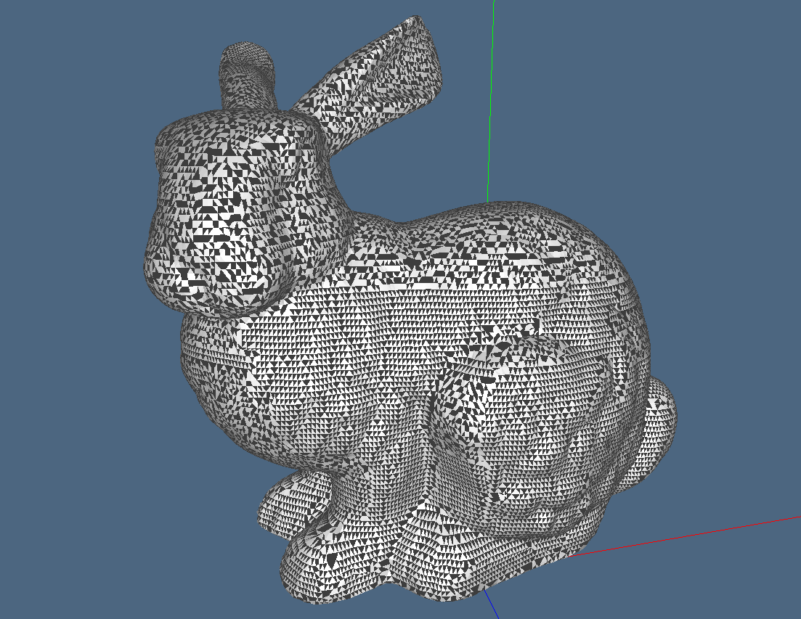

L'oggetto Bunny (e in generale qualunque oggetto utilizzato in questa libreria) è rappresentato attraverso una particolare struttura dati detta LAR (Linear Algebraic Representation), 
cioè uno schema di rappresentazione generale per la modellazione geometrica e topologica.
Il dominio di questa rappresentazione è dato da complessi cellulari, mentre il suo codominio è un insieme di matrici sparse.

La rappresentazione LAR è estremamente efficace per rappresentare facilmente solidi generali.

Ad esempio, la rappresentazione in memoria di un complesso cellulare $d=3$ utilizzando LAR consiste in due 
sole matrici sparse binarie per la topologia e un array bidimensionale per la geometria.

Nel caso di Bunny, la sua struttura dati (necessaria per la visualizzazione 3D attraverso la libreria *Plasm.jl*)
è caratterizzata da:

* V: 3×35947 Matrix{Float64}, una matrice di Float64 che rappresenta la geometria, cioè tutti i vertici che caratterizzano l'oggetto;
* FV: 69451-element Vector{Vector{Int64}}, un vettore di vettori di Int64 che rappresenta la topologia, cioè tutte le facce dell'oggetto;

Possiamo osservare alcuni valori di queste due strutture:

	julia> V
	3×35947 Matrix{Float64}:
	 -0.03783   -0.044779  -0.06801   ...  -0.070454  -0.031026  -0.040044
	  0.12794    0.128887   0.151244        0.150585   0.153728   0.15362
	  0.004475   0.001905   0.037195       -0.043458  -0.003546  -0.008167

	julia> FV
	69451-element Vector{Vector{Int64}}:
	 [20400, 21216, 21217]
	 [9187, 9281, 14839]
	 ...
	 [17280, 17347, 34910]
	 [17278, 17347, 34910]
	 [17278, 17346, 17347]

Possiamo visualizzare qualche triangolo della struttura dati dello *Stanford Bunny* (Figure 3), in particolare visualizziamo i seguenti triangoli:

	julia> V = hcat(VV)
	3×7 Matrix{Float64}:
	 -0.03783   -0.038818  -0.03745   -0.039193  -0.036508  -0.036802  -0.038119
	  0.12794    0.128112   0.127748   0.128299   0.127508   0.127806   0.128235
	  0.004475   0.00411    0.003144   0.005436   0.003484   0.00486    0.005845

	julia> FV
	6-element Vector{Vector{Int64}}:
	 [1, 470, 1620]
	 [1, 470, 14339]
	 [1, 1620, 6762]
	 [1, 2131, 6762]
	 [1, 2131, 14331]
	 [1, 14331, 14339]
	 
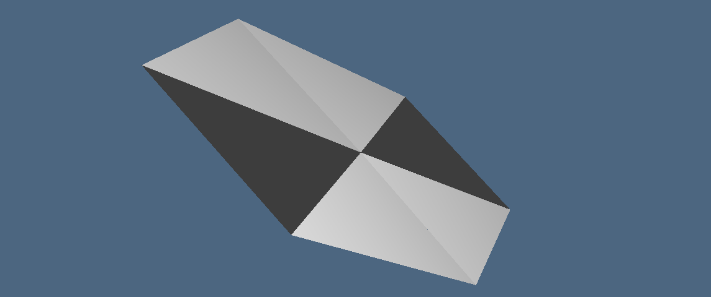

Inoltre, come si descriveva inizialmente, è possible osservare (Figure 4) dei buchi al 
di sotto dello *Stanford Bunny*, tre di questi erano il risultato di una copertura 
inadeguata durante la scansione, e i due fori circolari sulla base esistevano sul Bunny fisico, che era vuoto.

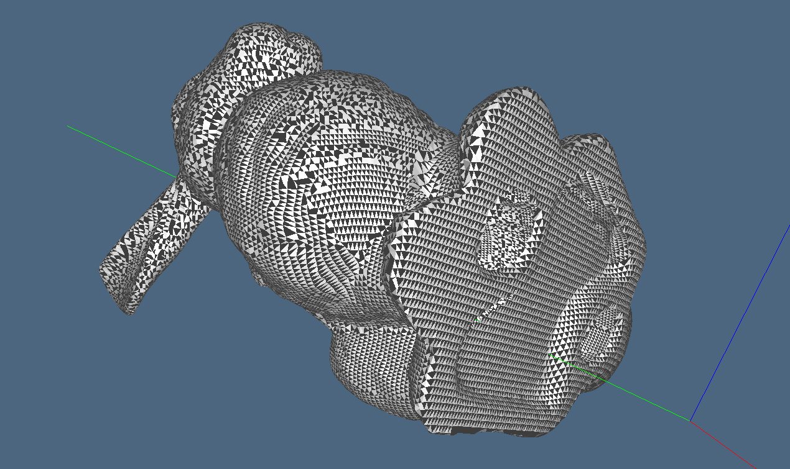

Dal momento che la funzione principale di integrazione del modulo è la funzione 
`TT(tau::Array{Float64,2}, alpha::Int, beta::Int, gamma::Int, signedInt::Bool=false)` valutiamo i suoi tempi d'esecuzione attraverso la
macro `@benchmark`, andando a calcolare l'integrale di superficie (con la funzione `TT`) di un triangolo del tipo `tau = [0.0 1.0 0.0; 0.0 0.0 1.0; 0.0 0.0 0.0]`.

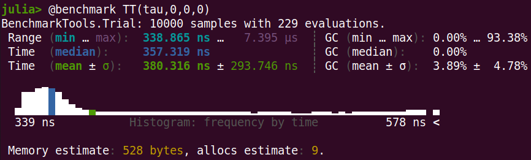

Oltre a questo, valutiamo i tempi d'esecuzione della funzione `volume(P::LAR, signedInt::Bool=false)::Float64`, calcolando il volume
dell'oggetto *Stanford Bunny*:

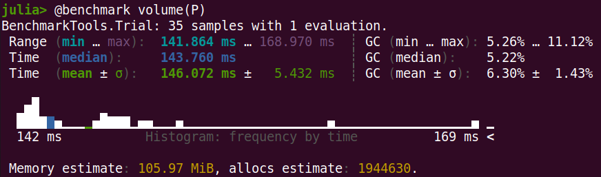

Come si può osservare (Figure 5 e 6), si ha come media d'esecuzione i seguenti valori:

* Funzione `TT`: 380.316 ns $\pm$ 293.746 ns
* Funzione `volume`: 146.072 ms $\pm$ 5.432 ms

## Osservazioni preliminari

Dallo studio preliminare sono emersi dei problemi per quanto riguarda il calcolo del volume di un'oggetto. Infatti, la funzione `volume`, 
e di conseguenza `III`, non prevedeva il parametro `signedInt::Bool`, quindi venivano calcolati gli integrali con segno e 
facendo la somma con segno degli integrali sui triangoli `tau` il volume dell'oggetto *Stanford Bunny* veniva pressoché 0.

Le funzioni `volume` e `III` sono state modificate in modo da permettere il calcolo dell'integrale senza segno.

Viene poi ridefinita la funzione `obj2lar(path)`, nel file *utilities.jl*, dal momento che nella libreria *LinearAlgebraicRepresentation.jl*
presenta un errore nell'ultima riga di codice che è stata corretta in:

	return convert(Lar.Points, vs'), edges[1:end], faces[1:end]

La riga originale era:

	return convert(Lar.Points, vs'), edges[2:end], faces[2:end]

\newpage

## Ottimizzazione del codice

La prima modifica apportata al codice è stata quella di dividere la funzione `TT` in funzioni più piccole; in particolare, è stata divisa
la parte di codice relativo ai loop annidati.

Per ogni loop, a partire da quello più in profondità, è stata definita una relativa funzione:

	function s4(a, b, h, k, m, i, j)
		ss4 = 0.0
		for l=0:m
			ss4 += binomial(m,l) * a[3]^(m-l) * b[3]^l * M(h+k+m-i-j-l, i+j+l)
		end
		return ss4
	end

	function s3(a, b, h, k, m, i)
		ss3 = 0.0
		for j=0:k
			ss3 += binomial(k,j) * a[2]^(k-j) * b[2]^j * s4(a, b, h, k, m, i, j)
		end
		return ss3
	end

	function s2(a, b, h, k, m)
		ss2 = 0.0
		for i=0:h 
			ss2 += binomial(h,i) * a[1]^(h-i) * b[1]^i * s3(a, b, h, k, m, i);
		end
		return ss2
	end

	function s1(a, b, alpha, beta, gamma, vo)
		ss1 = 0.0
		for h=0:alpha
			for k=0:beta
				for m=0:gamma
					ss1 += binomial(alpha,h) * binomial(beta,k) * binomial(gamma,m) * 
					       vo[1]^(alpha-h) * vo[2]^(beta-k) * vo[3]^(gamma-m) * 
					       s2(a, b, h, k, m)
				end
			end
		end
    	return ss1
	end

\newpage

I loop all'interno della funzione `s1` sono stati ridotti in un unico loop come segue:

	function s1(a, b, alpha, beta, gamma, vo)
		ss1 = 0.0
		for x=0:((alpha+1) * (beta+1) * (gamma+1))
			h = x ÷ ((beta+1) * (gamma+1))
			k = (x - h * (beta+1) * (gamma+1)) ÷ (gamma + 1) 
			m = (x - h * (beta+1) * (gamma+1)) % (gamma + 1) 
			ss1 += binomial(alpha,h) * binomial(beta,k) * binomial(gamma,m) * 
			       vo[1]^(alpha-h) * vo[2]^(beta-k) * vo[3]^(gamma-m) * 
			       s2(a, b, h, k, m)
		end
		return ss1
	end

Quindi il nuovo grafo delle dipendenze è il seguente:

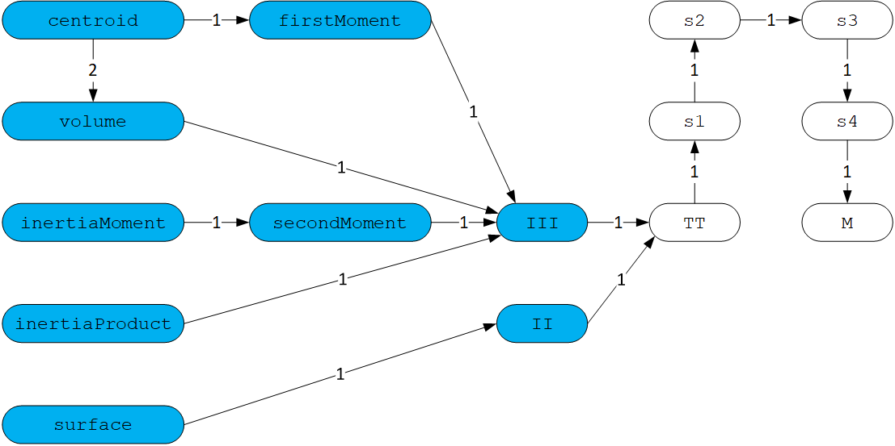

Per quanto riguarda l'ottimizzazione del codice si è deciso di scompattare
la funzione `TT` per particolari valori di $\alpha$, $\beta$ e $\gamma$ in modo da 
rendere il calcolo integrale molto efficiente. 

Consideriamo i seguenti casi:

* Superficie: $\alpha = 0, \beta = 0, \gamma = 0$
* Volume: $\alpha = 0, \beta = 0, \gamma = 0$
* Momento primo rispetto $x$: $\alpha = 1, \beta = 0, \gamma = 0$
* Momento primo rispetto $y$: $\alpha = 0, \beta = 1, \gamma = 0$
* Momento primo rispetto $z$: $\alpha = 0, \beta = 0, \gamma = 1$
* Momento secondo rispetto $x$: $\alpha = 2, \beta = 0, \gamma = 0$
* Momento secondo rispetto $y$: $\alpha = 0, \beta = 2, \gamma = 0$
* Momento secondo rispetto $z$: $\alpha = 0, \beta = 0, \gamma = 2$
* Prodotto d'inerzia rispetto $x$: $\alpha = 0, \beta = 1, \gamma = 1$
* Prodotto d'inerzia rispetto $y$: $\alpha = 1, \beta = 0, \gamma = 1$
* Prodotto d'inerzia rispetto $z$: $\alpha = 1, \beta = 1, \gamma = 0$

**N.B.**: come si evince dal grafo delle dipendenze (Figure 7), tutte le funzioni sopra elencate chiamano a loro volta, con 
gli stessi parametri $\alpha$, $\beta$ e $\gamma$, le funzioni `II` e `III`; in particolare, `II` fa una chiamata a `TT` sempre con i parametri $\alpha$, $\beta$ e $\gamma$,
mentre `III` fa una chiamata a `TT` con i paramentri $\alpha + 1$, $\beta$ e $\gamma$.

L'unica funzione che chiama `II` è `surface`, tutte le altre, `volume`, `firstMoment`, `secondMoment` e `inertiaProduct` chiamano `III`.

Quindi, per il calcolo della superficie i parametri passati a `TT` rimangono invariati, mentre per il calcolo di volume, momento primo, momento secondo e prodotto d'inerzia
i parametri passati alla funzione `TT` sono gli stessi, eccetto per $\alpha$ che viene incrementato di 1.

A questo punto i casi di studio della funzione `TT` diventano:

* Superficie: $\alpha = 0, \beta = 0, \gamma = 0$
* Volume: $\alpha = 1, \beta = 0, \gamma = 0$
* Momento primo rispetto $x$: $\alpha = 2, \beta = 0, \gamma = 0$
* Momento primo rispetto $y$: $\alpha = 1, \beta = 1, \gamma = 0$
* Momento primo rispetto $z$: $\alpha = 1, \beta = 0, \gamma = 1$
* Momento secondo rispetto $x$: $\alpha = 3, \beta = 0, \gamma = 0$
* Momento secondo rispetto $y$: $\alpha = 1, \beta = 2, \gamma = 0$
* Momento secondo rispetto $z$: $\alpha = 1, \beta = 0, \gamma = 2$
* Prodotto d'inerzia rispetto $x$: $\alpha = 1, \beta = 1, \gamma = 1$
* Prodotto d'inerzia rispetto $y$: $\alpha = 2, \beta = 0, \gamma = 1$
* Prodotto d'inerzia rispetto $z$: $\alpha = 2, \beta = 1, \gamma = 0$

La funzione `TT` è stata dunque scompattata in modo da rendere il calcolo dell'area del triangolo, per questi particolari parametri, più efficiente, evitando di effettuare la chiamata alla funzione `s1`. 

Di seguito si riporta a titolo d'esempio solo un pezzo della nuova funzione `TT`.

    function TT(...)
    	...
		if alpha == 0 && beta == 0 && gamma == 0
		    area_tt = M(0,0)
		elseif alpha == 1 && beta == 0 && gamma == 0
		    area_tt = vo[1] * M(0,0) + a[1] * M(1,0) + b[1] * M(0,1)
		elseif ...
			...
		else
		    area_tt = s1(a, b, alpha, beta, gamma, vo)
		end
		if signedInt == true
		    return area_tt * norm(c) * sign(c[3])
		else
		    return area_tt * norm(c)
		end
	end
	
	
Valutiamo i tempi d'esecuzione della funzione `volume(P::LAR, signedInt::Bool=false)::Float64`, a seguito dell'ottimizzazione fatta alla funzione `TT`, calcolando il volume
dell'oggetto *Stanford Bunny*:

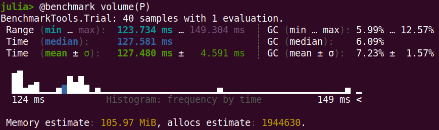

Come si può osservare (Figure 8), si ha come media d'esecuzione il valore:

* Funzione `volume`: 127.480 ms $\pm$ 4.591 ms

Confrontando i tempi con la versione iniziale, si può notare un **miglioramento** di circa
18.592 ms.

## Parallelizzazione del codice

Si può osservare come le funzioni `II` e `III` non fanno altro che calcolare la superficie di ogni
triangolo (attraverso la funzione `TT`) e poi sommare questi valori.
Queste due funzioni si prestano molto bene alla parellelizzazione, dal momento che il calcolo della superficie
dei singoli triangoli è indipendente e l'unico problema di concorrenza è la somma cumulativa di queste superfici. 
A tal scopo, per evitare problemi di concorrenza viene definito un array ausiliario, dove ogni cella
è "assegnata" ad un thread il quale fa la somma cumulativa delle superfici dei triangoli salvando il
risultato nella propria cella. 

Per quanto riguarda l'implementazione parallela, sono state utilizzate le macro offerte da Julia, in particolare:

* `@threads`: davanti ai cicli così che ogni iterazione sia assegnata ad uno specifico thread;
* `@inbounds`: per rimuovere i controlli sul limite degli array;

La somma totale viene infine calcolata con la funzione `sum`.

A titolo d'esempio si riportano le modifiche effettuate alla funzione `III`:

	function III()
		...
		partialSum = zeros(length(nthreads()))
		@threads for i=1:length(FV)
		    ...
		    term = c[1]/norm(c) * TT(tau, alpha+1, beta, gamma, signedInt)
		    if signedInt
		        @inbounds partialSum[threadid()] = term
		    else
		        @inbounds partialSum[threadid()] = abs(term)
		    end
		end
		return sum(partialSum)/(alpha + 1)
	end

Valutiamo i tempi d'esecuzione della funzione `volume(P::LAR, signedInt::Bool=false)::Float64`, 
a seguito della parallelizzazione, calcolando il volume dell'oggetto *Stanford Bunny*:

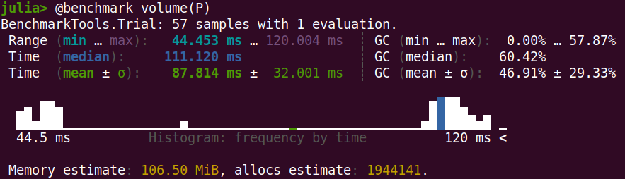

**N.B.**: in questo esempio è stato fatto lanciando Julia con il comando `julia -t 4`, in modo
da far girare il codice in modo parallelo su 4 thread. 

Come si può osservare (Figure 9), si ha come media d'esecuzione il valore:

* Funzione `volume`: 87.814 ms $\pm$ 32.001 ms

Anche se la media varia molto ($\pm$ 32.001 ms), confrontando i tempi con 
la versione ottimizzata, si può notare un **miglioramento** di circa 39.666 ms rispetto la media.

Sono stati poi presi i tempi (considerando sempre il calcolo del volume dell'oggetto *Stanford Bunny*)
della versione parallela eseguendo il codice su 1, 2, 4 e 8 thread, ottenendo i seguenti risultati:

|Numero di Thread|Media (ms)|Deviazione (ms)|Min (ms)|Max (ms)|
|:---|:---|:---|:---|:---|
|1|133.843|2.843|130.556|143.857|
|2|102.186|11.621|90.465|127.617|
|4|87.814|32.001|44.453|120.004|
|8|83.692|84.708|24.924|222.583|

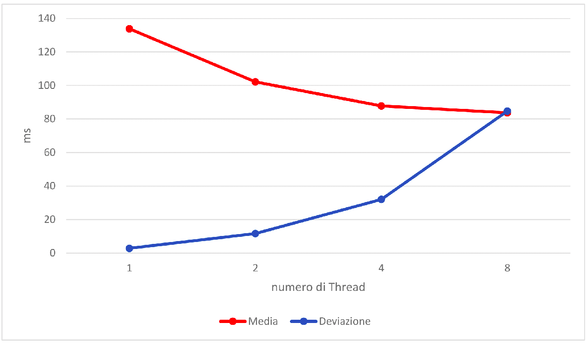

Dal grafico (Figure 10) notiamo come aumentando il numero di thread diminuisce la media d'esecuzione (rimane molto simile fra 4 e 8 thread), ma aumenta drasticamente la varianza.

Stesse considerazioni possono essere fatte visualizzando il minimo e 
il massimo tra i tempi d'esecuzione (Figure 11). Infatti, in tal caso
notiamo come all'aumentare del numero di thread utilizzati il minimo si abbassa molto fino a 4 thread e con 8 thread diminuire di poco, 
mentre il massimo tende a rimanere stabile fino a 4 thread per poi aumentare drasticamente con 8 thread.

Da questo possiamo concludere, che per far girare la versione parallelizzata di questo codice, l'ideale sembrerebbe utilizzare un numero di thread tra 2 e 4.

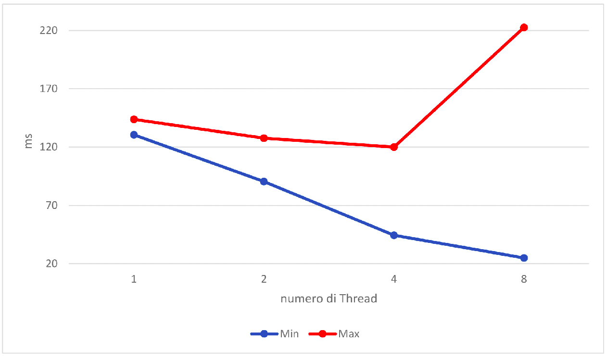

Consideriamo poi le seguenti tre funzioni:

* `firstMoment(P::LAR)::Array{Float64,1}`
* `secondMoment(P::LAR)::Array{Float64,1}`
* `inertiaProduct(P::LAR)::Array{Float64,1}`

Dal momento che all'interno delle funzioni sopra specificate sono presenti tre chiamate a funzione indipendenti e quindi senza problemi di concorrenza, è possibile definire mediante la macro `@async` i seguenti task.

A titolo d'esempio si riporta la definizione della funzione `firstMoment`.

	function firstMoment(P::LAR)::Array{Float64,1}
		out = zeros(3)
		@async begin
		    out[1] = III(P, 1, 0, 0)
		    out[2] = III(P, 0, 1, 0)
		    out[3] = III(P, 0, 0, 1)
		end
		return fetch(out)
	end

\newpage

## Conclusioni

In definitiva, si è riusciti ad ottenere una buona ottimizzazione del codice con conseguente
riduzione dei tempi d'esecuzione del calcolo integrale; in particolare, è stata ottimizzata
la funzione `TT` che permette il calcolo della superficie di un triangolo.

Questo è stato fatto prima scomponendo la funzioni in funzioni più piccole, poi andando a definire
quali fossero i valori dei parametri di $\alpha, \beta, \gamma$ utilizzati in modo da semplificare la funzione
di partenza implementata da `TT`.

In cascata, quindi, sono migliorate anche le prestazioni di tutte le interfacce del modulo, come il calcolo
della superficie e del volume.

Dove è stato possibile sono state utilizzate le macro offerte da Julia, come `@async` per definire i task asincroni e 
`@threads` per parallelizzare i cicli for. Sono poi state valutate le prestazioni del codice parallelizzato notando un effettivo miglioramento
con un numero di thread pari a 2 o 4.

In conclusione è possibile osservare la seguente riduzione dei tempi d'esecuzione (considerando sempre il calcolo del volume 
dell'oggetto *Stanford Bunny*):

|Versione||Media (ms)|Deviazione (ms)|
|:---|:---|:---|:---|:---|
|Versione Iniziale|146.072|5.432|
|Versione Ottimizzata|102.186|4.591|
|Versione Parallelizzata (2 thread)|102.186|11.621|

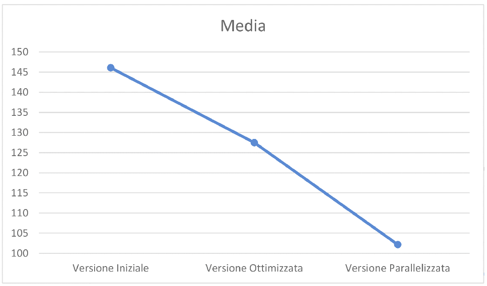

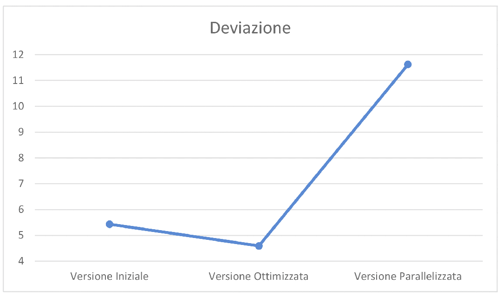 

## Interfacce principali

Le interfacce principali, come si evince anche dal grafo delle dipendenze (Figure 1), sono:

* `surface(P::LAR, signedInt::Bool=false)::Float64`

* `volume(P::LAR)::Float64`

* `centroid(P::LAR)::Array{Float64,1}`

* `inertiaProduct(P::LAR)::Array{Float64,1}`

* `inertiaMoment(P::LAR)::Array{Float64,1}`

* `II(P::LAR, alpha::Int, beta::Int, gamma::Int, signedInt=false)::Float64`

* `III(P::LAR, alpha::Int, beta::Int, gamma::Int, signedInt::Bool=false)::Float64`

* `firstMoment(P::LAR)::Array{Float64,1}`

* `secondMoment(P::LAR)::Array{Float64,1}`

\newpage

## Link Github

> https://github.com/paolo-di-simone/Integrals.jl.git

## Specifiche macchina per valutazione prestazioni

Le valutazioni delle prestazioni del codice sono state effettuate su una macchina con le seguenti specifiche:

	julia> versioninfo(verbose=true)
	Julia Version 1.7.2
	Commit bf53498635 (2022-02-06 15:21 UTC)
	Platform Info:
	  OS: Linux (x86_64-pc-linux-gnu)
		  Ubuntu 18.04.4 LTS
	 CPU: Intel(R) Xeon(R) CPU E5-2698 v4 @ 2.20GHz: 
		              speed         user        nice          sys          idle   irq
		   #1-80   3161 MHz   20647025 s   2613904 s   10892758 s   519083006 s   0 s
		   
	  Memory: 503.79284286499023 GB (464842.8515625 MB free)
	  Uptime: 691698.07 sec
	  Load Avg:  48.14  48.15  48.15
	  WORD_SIZE: 64
	  LIBM: libopenlibm
	  LLVM: libLLVM-12.0.1 (ORCJIT, broadwell)

## Bibliografia

> [1] Sheue-ling Lien and James T. Kajiya, A Symbolic Method for Calculating the Integral Properties of Arbitrary Nonconvex Polyhedra, California Institute of Technology, 1984.

> [2] C. Cattani and A. Paoluzzi, Boundary integration over linear polyhedra, 1990. 

